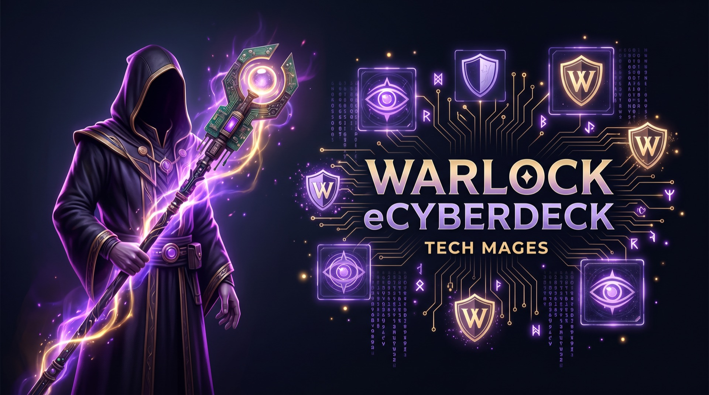
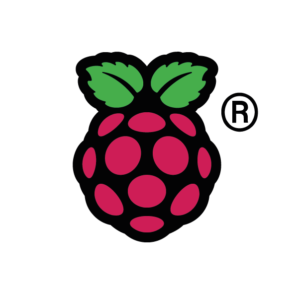

<div align="center">



# Warlock OS

**The field tech's Swiss-army knife — with teeth.**

[](docs/OVERVIEW.md)
[](#-architecture)
[](#warl0c--the-on-device-ai-operator)
[](#-provable-conduct--the-aar-signed-audit-trail)
[](CODE_OF_ETHICS.md)
[](#-the-engagement-gate)
[](LICENSE)
[](https://techmages.org)
[](https://hackergadgets.com)

</div>

---

> A self-contained, battery-powered **cyberdeck OS** that puts NetAlly/Fluke-class
> network diagnostics, full wireless recon-and-survey, SDR, off-grid mesh, blue-team
> auditing, and an on-device AI operator **behind one API, one authorization gate, and
> one signed audit trail**.

Warlock OS turns a [ClockworkPi uConsole](https://www.clockworkpi.com/uconsole) running a
Raspberry Pi **Compute Module 5** into a handheld security workstation. It's built to run
**dark**: offline, on battery, over LoRa mesh, with no cloud and no central server in the
loop. The diagnostics are sharp enough for a working MSP tech; the offensive tooling is
**inert until you arm a scoped engagement** — and everything the deck does (or *refuses* to
do) is signed and verifiable later by anyone holding a public key.

This is not "a Pi with Kali on it." Three things make it different:

| | |
|---|---|
| 🜂 **One platform, three faces** | A web console, a terminal UI, and an AI chat operator all speak to the *same* FastAPI backend. One source of truth for state, scope, and audit. |
| 🛡️ **A hard engagement gate** | Offense is dead weight until an operator arms a scoped *engagement*. Scope is enforced at execution time; there's a kill switch reachable from every interface. |
| ✍️ **Provable conduct** | Audit rows are emitted as cryptographically signed attestations (**Ed25519 / JCS / `did:web`**) a third party can verify **offline** — *verifying must never let you forge.* |

---

## ⚔️ The toolkit

The backend exposes **21 capability modules** through a registry — each one self-contained,
each one wired into the API, the web nav, and the TUI screen list. Grouped by domain:

### 🌐 Network diagnostics & field utility *(blue-team, local-by-default)*
| Module | What it does |
|---|---|
| `netdiag` | **Fluke/LinkRunner-class** link & path qualification — link speed/duplex (ethtool), Wi-Fi signal/bitrate (iw), **LLDP/CDP** nearest-switch + port + VLAN, DHCP/DNS/gateway health, `mtr` hop path + path-MTU, `iperf3` throughput, and a **one-button PASS / WARN / FAIL** roll-up. |
| `capture` | **"The shark."** Bounded `tshark` capture (BPF filters, ring buffer), **expert info** (retransmits / resets / dup-ACKs / zero-windows), top talkers, protocol hierarchy, Wireshark-compatible `.pcap` export. Always audited — chain of custody. |
| `voip` | RTP voice quality — **jitter, loss, out-of-order, MOS / R-factor** via the ITU-T G.107 **E-model** — SIP call-flow stats, and **DSCP/QoS EF-46 verification** (the #1 cause of choppy calls). |
| `nettools` | The small blades: **CIDR calculator**, offline **OUI vendor lookup**, **Wake-on-LAN**, **TLS/cert inspector** (issuer/SAN/expiry/weak proto), speed test. |
| `net_recon` | ARP & port scanning *(gated for wide/non-local ranges)* plus a **baseline + diff** blue-team monitor that flags new hosts, changed MACs, and ARP-spoofing. |
| `report` | **One-button site-survey / network-health report** → a client-ready HTML page (print-to-PDF), structured so the AAR generator can sign it into an attestation. |

### 📡 Wireless — survey, locate, wardrive
| Module | What it does |
|---|---|
| `wifi_analyzer` | **AirCheck-class survey** — AP map (BSSID/SSID/band/channel/RSSI/quality), per-band channel congestion & utilization, roam candidates — **plus the AP Location Finder**: a monitor-mode, **MAC-locked** (`wlan.ta`) RSSI **fox-hunt** with a real-time homing meter and Geiger-style proximity bell. |
| `wifi_recon` | Passive **wardriving** — `airodump-ng` in monitor mode, GPS-tagged AP/STA/handshake inventory, clear & export. No injection, no gate. |
| `wireless_ids` | **Kismet-driven blue-team IDS** — rogue-AP, evil-twin, and deauth/disassoc-flood detection, de-duplicated per session and pushed to the alert pager. |
| `wifi_offensive` 🔒 | *(gated)* Deauth, handshake/PMKID capture, **evil-twin** & **karma** (airbase-ng), **WPS** (reaver/bully). Every op checks scope; rogue-AP teardown is bounded by the kill switch. |
| `crack` | A managed **hashcat** queue — auto-converts `.cap/.pcap/.pcapng` to `.hc22000` (`hcxpcapngtool`), live `--status-json` progress, cracked-passphrase surfacing. The kill switch reaches it. |

### 🛰️ SDR · mesh · GPS
| Module | What it does |
|---|---|
| `sdr` | RTL-SDR receive + **ADS-B aircraft tracking** with a 43-field intel map (registration, operator, type, signal, FMS/altitude, derived wind), live over the event bus. |
| `sdr_offensive` 🔒 | *(hard-gated)* RF **capture** (record IQ), **replay** (TX — requires an active engagement **and** a named in-scope target before it keys the radio), and **analyze** (offline signal stats). HackRF TX, RTL-SDR RX. |
| `mesh` | **Meshtastic / LoRa SX1262** off-grid messaging — node list, channels, send, packet tail. |
| `gps` | u-blox GPS on UART with **1-PPS time discipline** — position & NTP reference clock. |
| `esp32_companion` | ESP32-Marauder serial-bridge sidekick. |

### 🔍 Audit · platform · attestation
| Module | What it does |
|---|---|
| `server_audit` | The MSP audit capability — `nmap --script vuln`, `nikto`, `lynis`, and SSH-config review, normalized into one finding schema. Remote targets are gated; SSH passwords go via `sshpass -e`, never argv or the log. |
| `dashboard` | At-a-glance deck health — throttle, temp, disk, radios, GPS, mesh, engagement state — computed off the event loop so polls never stall the API. |
| `ops` | Engagement lifecycle UI — arm, scope, authorize, end. |
| `system` · `audio` | Hardware, services, and audio subsystem control. |

> 🔒 = **engagement-gated.** Offensive capability is inert until an operator arms a scoped
> engagement. Out-of-scope or no-engagement requests are **refused and logged**, not run.

---

## 🛡️ The engagement gate

The safety model isn't a disclaimer — it's the architecture.

- An **engagement** is an authorized test window with an explicit **scope**: the hosts,
  CIDR subnets, SSIDs, and BSSIDs you're allowed to touch, plus a free-text authorization
  statement.
- `engagement.check_target()` is evaluated **at execution time** by every offensive op.
  `ScopeAllowlist.matches()` resolves a target against the allowlist — including
  **subnet-in-CIDR** containment and exact host/SSID/BSSID entries.
- Out-of-scope or no-engagement requests are **refused** and written as a `scope.violation`
  audit row (and fired to the alert bus). Accepted jobs write a `job.submit` row.
- **Kill switch** — cancels the shared job runner **and** reaches into each independent
  module queue (`crack`, `server_audit`), restores wireless interfaces to managed mode, and
  is reachable from web, TUI, **and** the AI agent.

## ✍️ Provable conduct — the AAR signed audit trail

Every audit row is, in addition to the local chained log, emitted as a signed
**Agent Attestation Record (AAR)**:

- **Ed25519** asymmetric signatures — *no HMAC; verifying must never confer forging.*
- **`did:web`** identity: the deck signs as a console DID under the org principal, holding
  its own private key in a `0600` file keystore.
- **JCS (RFC 8785)** canonicalization so records cross-verify exactly.
- A `prior` hash chains records tamper-evidently; an optional transparency-log receipt
  (`log`) upgrades a record to verifiable **log-inclusion (L3)**.
- A reference verifier confirms each record **offline** — no server in the loop.

This is what lets an MSP prove to a client — or an auditor, or a court — exactly what the
deck did and refused to do, **without anyone having to trust the deck.**

---

## 🏗️ Architecture

One FastAPI backend (module-registry pattern) behind Basic auth; three front-ends over the
same HTTP + WebSocket API; the radios and sensors of the cyberdeck underneath.

```
        ┌──────────── front-ends (TypeScript / HTTP) ─────────────┐
  Web console (React·Vite·Leaflet)   Ink TUI (terminal)   WaRL0c AI chat
        └───────────────────────┬─────────────────────────────────┘
                                │  HTTP + WebSocket  (one API)
                     ┌──────────▼───────────┐
                     │   FastAPI backend     │  Basic auth on every route
                     │   module registry     │  21 capability modules
                     ├───────────────────────┤
                     │  engagement gate       │  scope + audit + kill switch
                     │  job runner + queues   │  crack / server-audit queues
                     │  event bus (/ws)       │  live updates to every client
                     │  audit log → AAR       │  signed attestation records
                     └──────────┬─────────────┘
                                │
          radios · SDR · GPS · mesh · system   — the cyberdeck hardware
```

| Surface | Tech | Role |
|---|---|---|
| **Backend** | FastAPI · Uvicorn · Pydantic v2 · SQLAlchemy · `cryptography` (Ed25519) · `rfc8785` (JCS) | The one source of truth: modules, gate, job runner, event bus, AAR. |
| **Web console** | React · Vite · Leaflet (dark theme) | Full operator UI — dashboard, guided wireless flow, SDR/ADS-B map, IDS pager, audit log. |
| **Ink TUI** | Ink (React-for-CLI, TypeScript) | Terminal console for the deck's screen or over SSH; geometry-robust. |
| **WaRL0c** | PI agent libs (`@earendil-works/pi-*`) + OpenAI-compatible provider | On-device AI operator (see below). |

### WaRL0c — the on-device AI operator

WaRL0c is an instructional AI assistant that runs **on the deck** and can drive it —
*within the gate.*

- **Read tools (always on):** ~19 read-only tools wrapping the API's GET endpoints, so the
  agent can orient an operator on deck status, recon results, IDS alerts, and captures.
- **Action tools (gated):** ~19 tools that POST to the **same gated endpoints the human
  uses** — arm/end an engagement, scan, capture, run offensive ops, submit cracks and
  audits, drive SDR, and hit the kill switch.
- **Autonomy bounds:** the agent operates tools autonomously **only inside an active
  engagement**; it can't arm an engagement or fabricate authorization on its own, it
  explains every action, and on any refusal (403 / out-of-scope) it **explains and stops**
  rather than routing around the gate. These properties are enforced by tests.

---

## 🚀 Quickstart

> Warlock OS is designed for the cyberdeck, but the backend, web console, and TUI all run on
> any Linux/macOS workstation for development. Tools that touch real radios (monitor mode,
> SDR, GPS, mesh) degrade gracefully when the hardware/CLIs aren't present.

### Backend (FastAPI · Python ≥ 3.11)

```bash
git clone https://github.com/techmages-org/warlock.git
cd warlock

# uv (recommended)
uv venv --python 3.13
source .venv/bin/activate
uv pip install -e ".[dev]"

python -m warlock          # serves the API + web UI on http://localhost:7777
# (equivalent console entrypoint: `warlock-server`)
```

Default web auth is **`warlock` / `warlock`** — set `WARLOCK_WEB_PASSWORD` and **change it
on first use.** Health check: `curl http://127.0.0.1:7777/api/health` → `{"ok":true}`.

### Web console (React · Vite)

```bash
cd web
npm install
npm run build      # FastAPI then serves the built console at :7777
# or, for live reload during development:
npm run dev        # Vite dev server (proxies the API)
```

### Terminal UI + WaRL0c (Ink · TypeScript)

```bash
cd tui-ink
npm install
npm run build
node dist/cli.js     # the TUI  (also exposed as `warlock-tui`)
node dist/chat.js    # WaRL0c chat  (also exposed as `warlock-chat`)
```

Common env vars (full list in `src/warlock/config.py`):

| Var | Default | Purpose |
|---|---|---|
| `WARLOCK_HOST` / `WARLOCK_PORT` | `0.0.0.0` / `7777` | API bind host + port |
| `WARLOCK_WEB_PASSWORD` | `warlock` | **Change on first use.** Web Basic-auth password (user `warlock`). |
| `WARLOCK_DATA` | `~/warlock` | Operator data root (engagements, captures, reports, keystore) |
| `WARLOCK_MESH_HOST` / `WARLOCK_MESH_PORT` | `127.0.0.1` / `4403` | meshtasticd native API |
| `WARLOCK_GPSD_HOST` / `WARLOCK_GPSD_PORT` | `127.0.0.1` / `2947` | gpsd |

📖 **The full technical overview** — every module, the safety model, the build-your-own
hardware BOM, and the staged build playbook — lives in **[docs/OVERVIEW.md](docs/OVERVIEW.md)**.

---

## 🛠️ The cyberdeck (build-your-own)

Warlock is a build, not a product you buy — and the build is only possible because of the
boards from **[Hacker Gadgets](https://hackergadgets.com)**, who turn a ClockworkPi uConsole
into a real cyberdeck. **This project couldn't exist without their hardware.**

| Component | Source | Detail |
|---|---|---|
| **Chassis** | [ClockworkPi](https://www.clockworkpi.com/uconsole) | uConsole — handheld keyboard, LCD, battery |
| **Compute** | Raspberry Pi | **Compute Module 5** (CM4 / Radxa CM5 also supported) |
| **Upgrade kit** | [Hacker Gadgets](https://hackergadgets.com/products/uconsole-upgrade-kit?variant=47045223383214) | CM4/CM5 adapter + NVMe board + **dual-18650 battery**. **Boots from NVMe.** |
| **Storage** | *source your own* | **Any M.2 NVMe SSD** — your choice of capacity |
| **AIO V2** | [Hacker Gadgets](https://hackergadgets.com/products/uconsole-aio-v2?variant=47045380735150) | The radio board: **RTL-SDR + LoRa SX1262 + GPS/PPS + RTC + internal USB hub + RJ45** |
| **AC1200 Wi-Fi** | [Hacker Gadgets](https://hackergadgets.com/products/ac1200-usb-c-wifi-card) | AC1200 USB-C card (**MediaTek MT7921AUN**) — Wi-Fi 6/6E **monitor mode + injection** *and* **Bluetooth 5.2**; rides the AIO's internal USB |
| **SDR (TX)** | — | **HackRF** for replay/transmit (RX is the AIO's RTL-SDR) |
| **OS** | — | Debian 13 (trixie), aarch64 |

> 🛒 **Exact config we run:** Upgrade Kit → Adapter **Raspberry Pi CM4/CM5**, NVMe board
> **With Dual 18650 Batteries Holder**, Expansion Board **NONE** — then add the standalone
> **AIO V2** (it carries the SDR / LoRa / GPS and the internal USB) and the **AC1200 USB-C
> Wi-Fi card** for monitor mode. Drop in a **CM5**, source any M.2 NVMe, and you have the
> deck Warlock runs on.

📋 **Complete chipset-level spec — every board, every radio, what it can and can't do:
[docs/HARDWARE.md](docs/HARDWARE.md).** Full wiring, GPIO power-rail map, and
per-subsystem health probes are in [docs/OVERVIEW.md §5](docs/OVERVIEW.md).

---

## 🤝 Contributing & how to help

**These tools get better when defenders build them together** — and you don't have to write
a line of code to make the project stronger.

| Lane | What it looks like |
|---|---|
| 🧩 **Code** | New modules, bug fixes, hardening the gate, tests. Python (FastAPI) backend, Ink/React TUI, React/Vite web. |
| 🔌 **Hardware** | Build the deck from the BOM; tell us what worked and what didn't; test new SDR / GPS / mesh peripherals. |
| 📡 **Offensive buildout** | Flesh out the **ESP32-Marauder** integration over the serial bridge; deepen the gated red-team modules — *always behind the engagement gate.* |
| 📚 **Documentation** | Setup guides, module how-tos, the build playbook, fixing anything unclear. |
| 🧭 **Field reports** | You ran it on a real authorized engagement — tell us what held up and what was missing. |
| 🐞 **Triage & disclosure** | Reproduce issues, review PRs, help newcomers get a deck booting. Found a flaw *in the tooling itself?* Report it privately. |

**Good first contributions:** a `nettools` blade, an offline-OUI/dictionary refresh, a TUI
screen polish, a `netdiag` probe, or docs for a peripheral you got working.

> ### ⚖️ The Code of Ethics is non-negotiable
> Warlock builds for the profession: MSPs and security professionals on **authorized**
> engagements. Opening a PR, filing an issue, or shipping a build **affirms** the
> [**Code of Ethics**](CODE_OF_ETHICS.md) — authorization before action, honest scope,
> accountability over deniability. We **won't merge** anything whose purpose is to defeat the
> engagement gate, scope check, kill switch, or audit trail, or to target non-consenting
> third parties.

Start with **[CONTRIBUTING.md](CONTRIBUTING.md)** and the
[**Code of Ethics**](CODE_OF_ETHICS.md). **Contributors are welcome and credited.**

---

## 🙏 Acknowledgments

Warlock OS is software, but it runs on hardware — and the cyberdeck simply wouldn't exist
without **[Hacker Gadgets](https://hackergadgets.com)**. Their
[uConsole Upgrade Kit](https://hackergadgets.com/products/uconsole-upgrade-kit?variant=47045223383214),
[AIO V2](https://hackergadgets.com/products/uconsole-aio-v2?variant=47045380735150) (SDR + LoRa
+ GPS + internal USB + RJ45), and
[AC1200 USB-C Wi-Fi card](https://hackergadgets.com/products/ac1200-usb-c-wifi-card) (monitor
mode) are what give the deck its radios, its wired uplink, and its NVMe boot. **Thank you — this
couldn't be done without you.**

Built on the [ClockworkPi uConsole](https://www.clockworkpi.com/uconsole) and the
[Raspberry Pi](https://www.raspberrypi.com) Compute Module 5. An open project of
**[Titanium Computing](https://techmages.org)**.

<br>

<div align="center">

###### Built with · Powered by

<table border="0"><tr align="center" valign="middle">
<td><a href="https://www.clockworkpi.com/uconsole"></a></td>
<td width="44"></td>
<td><a href="https://hackergadgets.com"></a></td>
<td width="44"></td>
<td><a href="https://www.raspberrypi.com"></a></td>
<td width="44"></td>
<td><a href="https://techmages.org"></a></td>
</tr></table>

</div>

## 📜 License

Code and documentation are released under the **[MIT License](LICENSE)**. Names and marks are
reserved by their respective owners. By contributing you agree your contributions are licensed
under the repository's terms.

<div align="center">

---

*An open project of [**TechMages**](https://techmages.org). Use it on systems you own or are
authorized to test. Keep your scope honest. Keep your records.*

**The deck is the Warlock; the org is TechMages.** Build wisely. 🜂

</div>
